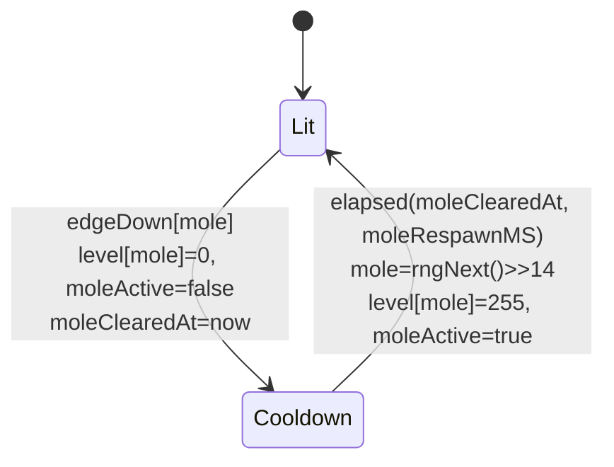
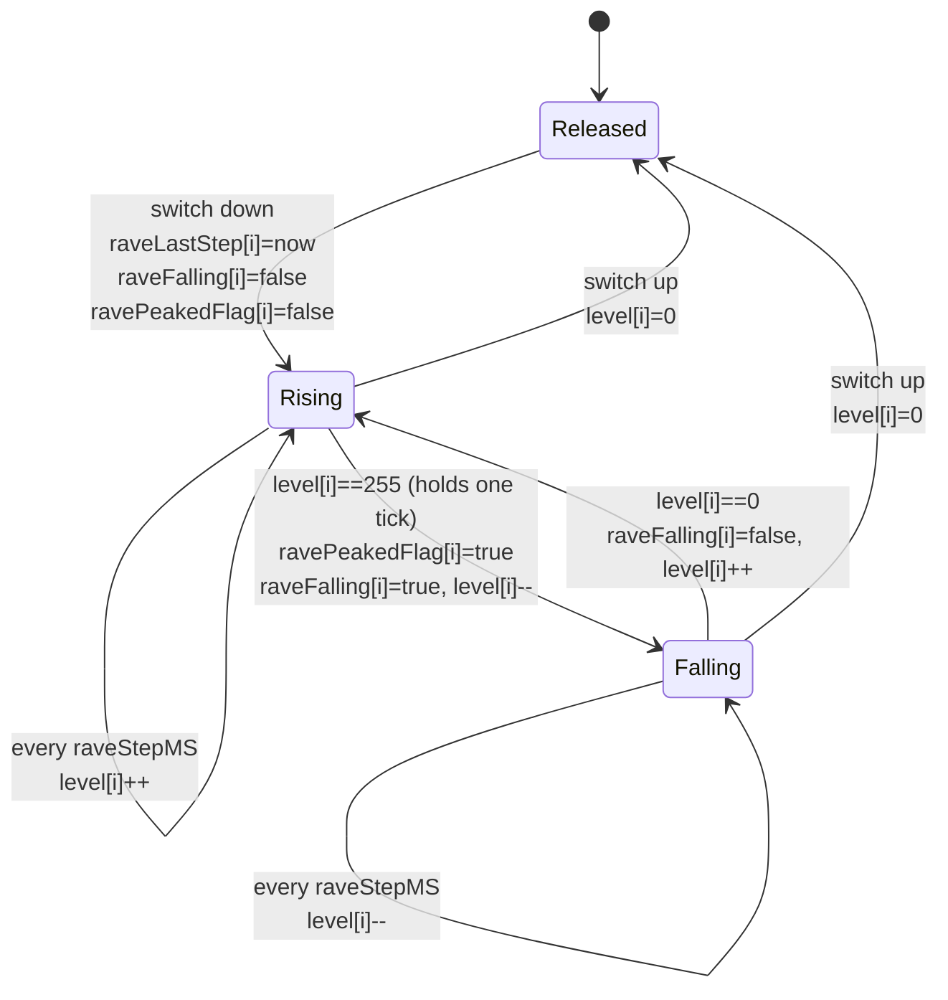
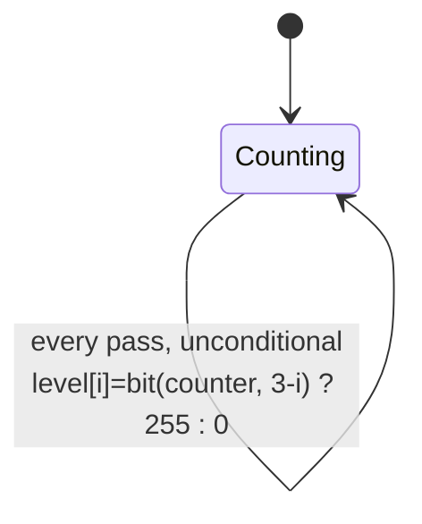
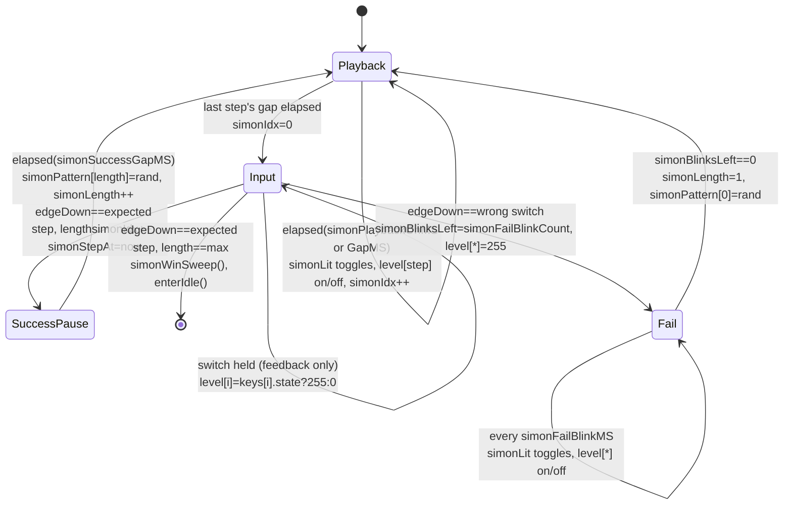
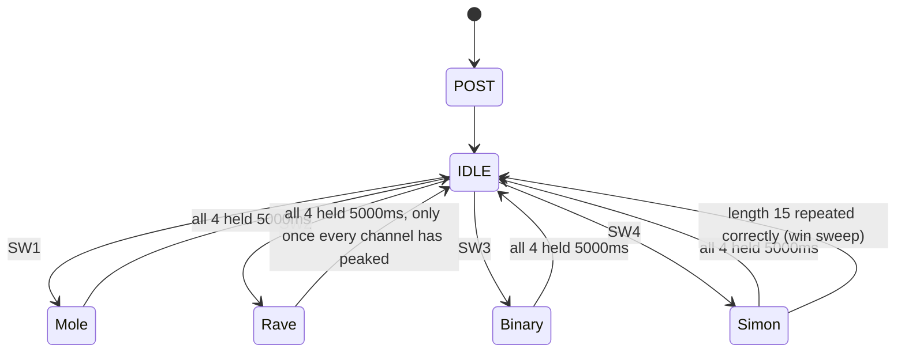

# Mode state machines & per-loop variable writes

One diagram per mode, read against `firmware/modes.go`. Each loop pass is one software-PWM carrier cycle — see `renderPWM()`.

**Board** Metro 328P · **Modes** 4 · **Source** `config.go` · `modes.go` · `main.go`

**Every pass, regardless of mode:** `sampleInputs()` and `collectEdges()` refresh `edgeDown[]`/`edgeUp[]`/`keys[i].state` before any mode code runs; `handleReset()` checks the all-four-held gesture and can pre-empt the mode update entirely; `renderPWM()` recomputes `disp[i] = gamma(level[i])` and redraws the carrier after it. The diagrams below cover only what each mode's own `update<Mode>()` adds on top of that.

---

## Mode 1 — Whack-A-Mole

One LED lit at a time. Hitting its switch clears it; a new one is picked after `moleRespawnMS`. Presses on any other switch are simply never read — there's no "wrong" branch to fail into.

Variables written at each transition:

| State | Trigger | Writes |
|---|---|---|
| Lit → Cooldown | correct switch pressed (`edgeDown[mole]`) | `level[mole]`=0 · `moleActive`=false · `moleClearedAt`=now |
| Cooldown → Lit | `elapsed(now, moleClearedAt, moleRespawnMS)` | `mole`=rngNext()>>14 · `level[mole]`=255 · `moleActive`=true |

---

## Mode 2 — Rave

Four independent channels, one per switch. Each runs its own Released / Rising / Falling cycle at `raveStepMS` per step. `ravePeakedFlag[i]` latches the instant a channel first reaches 255 — it never resets while the switch stays down, which is what lets the reset gesture's Rave exception work.

Per channel `i` — four copies run in the same pass, one iteration of the loop in `updateRave()` each.

Variables written at each transition (channel i):

| State | Trigger | Writes |
|---|---|---|
| any → Released | `!keys[i].state`, checked first every pass | `level[i]`=0 · `raveFalling[i]`=false · `ravePeakedFlag[i]`=false · `raveLastStep[i]`=now |
| Released → Rising | switch goes down | (same reset writes above; channel starts climbing from 0) |
| Rising (self) | `elapsed(now, raveLastStep[i], raveStepMS)` | `raveLastStep[i]`+=raveStepMS · `level[i]`++ |
| Rising → Falling | `level[i]==255` on the tick after reaching it | `ravePeakedFlag[i]`=true · `raveFalling[i]`=true · `level[i]`-- |
| Falling (self) | `elapsed(now, raveLastStep[i], raveStepMS)` | `raveLastStep[i]`+=raveStepMS · `level[i]`-- |
| Falling → Rising | `level[i]==0` | `raveFalling[i]`=false · `level[i]`++ |

---

## Mode 3 — Binary Counter

Barely a state machine — one accumulator, one self-loop. A completed click (press then release, minus the entry press swallowed by `swallowUp[i]`) increments `counter` and wraps 15→0. Every pass, all four LED levels are re-derived from the current bits, not just on the increment.

Variables written each pass:

| When | Trigger | Writes |
|---|---|---|
| Conditional | `edgeUp[i]` true and `swallowUp[i]` already consumed | `counter`=(counter+1)&0x0F |
| Unconditional | every pass, all four i | `level[i]` = 255 if bit (numKeys-1-i) of counter set, else 0 |

---

## Mode 4 — Simon

The one real state machine among the four. `simonPattern[]` grows by one random step per successful round, replayed from the start each time, up to `simonMaxLength`. A wrong press fails immediately into a synchronized blink; the correct press is checked before any wrong one, so a simultaneous mis-press can't cost you.

Win exit goes straight to IDLE via `enterIdle()`, bypassing the 5000ms reset gesture entirely — see the overview below.

Variables written at each transition:

| State | Trigger | Writes |
|---|---|---|
| Playback (self) | `elapsed(now, simonStepAt, on/gap)` | `simonStepAt`=now · `simonLit` flips · `level[pattern[idx]]` on/off · `simonIdx`++ (on gap end) |
| Playback → Input | last step's gap elapsed | `simonIdx`=0 |
| Input (self) | any switch held | `level[i]` mirrors `keys[i].state`, all i |
| Input → SuccessPause | expected edgeDown, `simonIdx<simonLength-1` | `simonIdx`++ · `simonStepAt`=now |
| Input → IDLE (win) | expected edgeDown at `simonLength==simonMaxLength` | allLEDsOff() · simonWinSweep() (blocking) · enterIdle() |
| Input → Fail | any wrong-switch edgeDown | `simonBlinksLeft`=simonFailBlinkCount · `simonLit`=true · `simonStepAt`=now · `level[*]`=255 |
| SuccessPause → Playback | `elapsed(now, simonStepAt, simonSuccessGapMS)` | `simonPattern[simonLength]`=rand · `simonLength`++ · (re-enter Playback at idx 0) |
| Fail (self) | `elapsed(now, simonStepAt, simonFailBlinkMS)` | `simonStepAt`=now · `simonLit` flips · `level[*]` on/off · `simonBlinksLeft`-- (on the off edge) |
| Fail → Playback | `simonBlinksLeft==0` | `simonLength`=1 · `simonPattern[0]`=rand |

---

## Overview — mode select & the reset gesture

How the four sections above connect to each other and to IDLE. `handleReset()` runs before every mode update and can fire from any of the four; Rave has the one exception (gated on all channels' `ravePeakedFlag`), and Simon's win condition is the one path back to IDLE that isn't the reset gesture at all.

---

Generated from `firmware/config.go`, `firmware/modes.go`, `firmware/main.go`.
